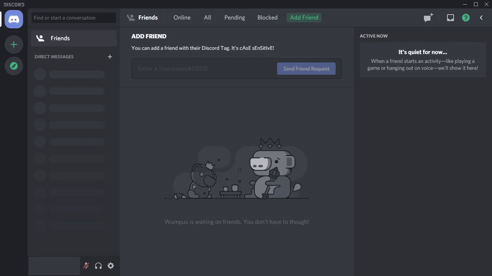

# Discord Hide Sidebar

I don't need the left sidebar all the time, so why not hide it when I need more screen dedicated to the messages?

**This script starts your Discord in debug mode.**
**This means that your personal information may be visible to other programs on your computer or others on the Internet.**
**Do not use this script unless you know what you're doing!**

**Using this script may also violate Discord's ToS and result in your account's termination.**

**By using this script, you acknowledge above potentials.**
**I will *not* be responsible for any damage caused by this script.**

If you don't know how to mitigate this risk and are not willing to take it, please wait for Discord to implement this functionality.

## Requirements

* Discord installed
* Python installed
  * Support for latest version (currently `3.8`) guaranteed
  * May work on `3.7` and above
* Libraries (can be installed via `pip install -r requirements.txt`)
  * [requests](https://requests.readthedocs.io/en/master/): tested on `2.24.0`
  * [websocket-client](https://github.com/websocket-client/websocket-client): tested on `0.57.0`

## How to use

When Discord is launched through the script, there'll be a `<` next to `?` on the top-right.
Click `<` to toggle. The toggle hides friends list and channels list



### Basic Usage

#### Windows

* If you want to see the console window, double click `hideside.bat`
* If you do not want to see the console window, double click `hideside.vbs`
  * Note this will also start Discord minimized

#### Others

Currently, these platforms are not supported because I don't currently have access to a testing machine.
However, it's possible the script will work, but you'll have to provide the location of Discord executable.

For example, for Discord installed in `/usr/bin/discord`, run:

```bash
python3 hideside.py -d "/usr/bin/discord"
```

### Advanced Usage

```text
usage: hideside.py [-h] [-d DISCORD_PATH] [-p {0-65535}] [-m]

Hide sidebar on Discord!

optional arguments:
  -h, --help            show this help message and exit
  -d DISCORD_PATH, --discord-path DISCORD_PATH
                        Path of Discord executable
  -p {0-65535}, --port {0-65535}
                        Port for the debugging session to run
  -m, --minimized       Use this to start Discord minimized
```

## Known issues

### The Discord client stutters/feels slower/uses more CPU

The performance is expected to dip but it should not be noticeable.
This is a side effect of debug mode. I'm not sure if this can be fixed.
I try to make the JavaScript payload as efficient as possible.

Please open an issue if the performance dip is severe.

### The toggle does not automatically show up when Discord boots

I'm not sure what the cause of this is and am looking into it.
If it doesn't show up, switch to another server and switch back.

### Can I get this to work on PTB version

Possibly, given that PTB is more prone to change.
Support is not guaranteed, but you're more than welcomed to try.
You can also open an issue if the script does not work for PTB.

If you have both PTB and non-PTB installed, the script will priorize non-PTB version.
You can still manually call PTB version by passing it into `-d DISCORD_PATH`.

## License

[Discord Hide Sidebar](https://github.com/Mushinako/Discord-Hide-Sidebar) by [Mushinako](https://github.com/Mushinako) is licensed under [CC BY-SA 4.0](https://creativecommons.org/licenses/by-sa/4.0)

  
